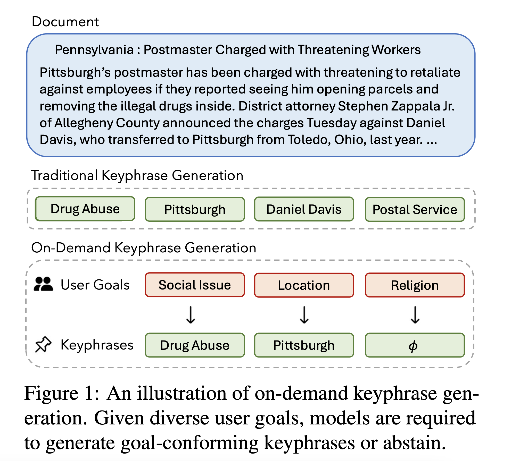

# MetaKP

<p align="center">
  <a href="https://xiaowu0162.github.io/metakp"></a>
  <a href="https://arxiv.org/pdf/2407.00191.pdf"></a>
</p>

🖋 Di Wu*, Xiaoxian Shen*, and Kai-Wei Chang

We introduce **on-demand keyphrase generation**, a novel paradigm that requires keyphrase predictions to conform to specific high-level goals or intents. 

We release **MetaKP**, a large-scale benchmarking dataset covering four datasets, 7500 documents, and 3760 goals from the news and biomedical text domain.



## Setup

### Data
The MetaKP dataset is officially released in the `data/` folder. Please download and uncompress the data to the `data/` folder. You can use the `get_data.sh` script to uncompress all the files in the corresponding folder. 
```
cd data
bash get_data.sh
cd ..
```
We cover datas in KPTimes, DUC2001, KPBiomed, and Pubmed. Each file has the following format:
* `humanvalid_processed_release.json`: This is a human valided data created using our pipeline.
* `rejection_augmented_release.json`: This is the rejection augmented version, for a document, all the negative goals are appended after positive goals.

Each file contains the following fields:
* `id`: the unique id for each goal, keyphrase pair.
* `title`: title of the document.
* `document`: document body.
* `goal`: the intended goal.
* `keyphrases`: a list of keyphrases that could be generated using the goal. 


### Envrionment
We recommend using a conda environment for the project. You may follow the steps below to set up.

```
conda create --name metakp python==3.8
conda activate metakp
pip install torch==1.13.1+cu117 torchvision==0.14.1+cu117 torchaudio==0.13.1 --extra-index-url https://download.pytorch.org/whl/cu117
pip install --upgrade -r requirements.txt
```

## Fine-tuning
### Pre-processing
Prepare the data by running `cd data ; python process_seq2seq.python `. The script will preprocess specified datasets. 

### Train
- `cd fine-tuning`
- Modify the parameters in `run_train_bart_multitask.sh` or `run_train_flan_t5_with_rejection.sh`. 
- `bash run_train_bart_multitask.sh` or `bash run_train_flan_t5_with_rejection.sh`

### Inference and Evaluation
```
bash run_test.sh
```

## Prompting

### Inference and Evaluation
- Run zero-shot goal rejection experiment
```
bash run_query_reject_zero_shot.sh
```
- Run zero-shot on-demand keyphrase generation experiment
```
bash run_query_kp_zero_shot.sh
```
- Run self-consistency prompting on-demand keyphrase generation experiment
```
bash run_query_kp_zero_shot_sample.sh
```
By default, the threshold for scoring keyphrases in self-consistency prompting evaluation is 0.3.


If you find this work helpful, please consider citing
```
@article{wu2024metakp,
      title={MetaKP: On-Demand Keyphrase Generation}, 
      author={Di Wu and Xiaoxian Shen and Kai-Wei Chang},
      year={2024},
      eprint={2407.00191},
      archivePrefix={arXiv},
      primaryClass={cs.CL},
      url={https://arxiv.org/abs/2407.00191}, 
}
```


